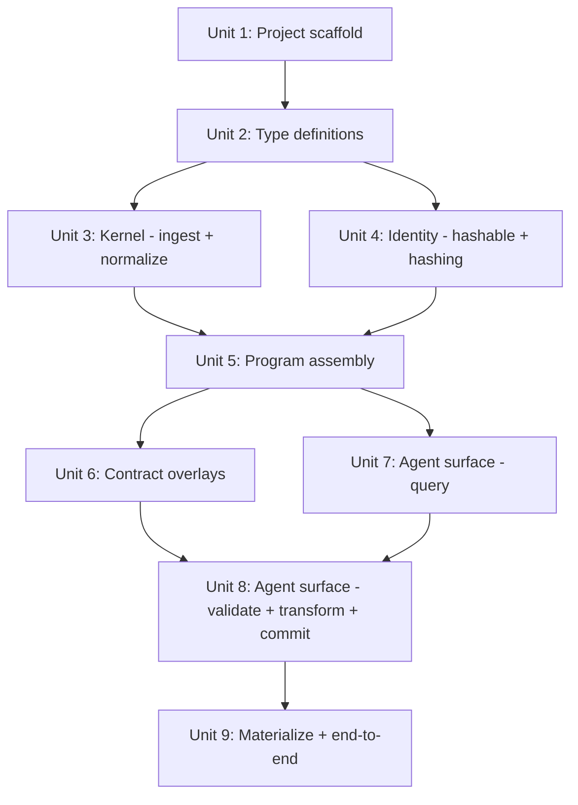

# v1 Vertical Slice: TS Ingest → Semantic Tree → Agent Surface

## Overview

Bootstrap the sema project from an empty repo to a working end-to-end vertical slice. A small TypeScript file goes in; a normalized semantic tree with stable content-addressed identity comes out; contract overlays attach; an agent surface exposes query/validate/transform/commit/materialize.

This is a research project. Optimize for learning speed, not production polish.

## Problem Frame

Semgrep operates at the syntactic pattern-matching level. We want to go deeper: a semantic substrate where the internal truth is a normalized tree, identity is content-addressed, and contracts (effect/capability/world) are first-class overlays. The v1 vertical slice proves this architecture works end-to-end on a small TS input.

## Requirements Trace

- R1. Ingest TS source via Compiler API → normalized SemanticNode tree
- R2. Assign stable syntaxHash (structural, rename/format-invariant) and semanticHash (includes resolved types/references)
- R3. Attach effect/capability/world contracts as overlays (not embedded in nodes)
- R4. Agent surface: resolve / inspect / slice / validate / transform / commit / materialize
- R5. Semantic patch → text materialization producing valid TS
- R6. Error model: skip unsupported syntax, collect diagnostics, never crash on valid TS

## Scope Boundaries

- Single-package project (no monorepo yet)
- v1 targets small TS files (< 1000 LOC), no incremental re-ingest
- No projectional editor, no IDE integration
- No runtime sandbox, no protocol DSL
- `transform` accepts developer-supplied functions, not a built-in rule engine or LLM
- World contract annotation syntax is programmatic API only (no JSDoc/decorator parser yet)
- Immutable tree: commit produces new SemanticProgram, old snapshots remain valid

## Context & Research

### Relevant Patterns

- **TS Compiler API**: `ts.createProgram` once → `program.getTypeChecker()` → `ts.forEachChild` for traversal. Use `ts.isXxx()` type guards. Filter out `.d.ts` and external library files.
- **Content-addressed hashing (Unison)**: Separate `Hashable` intermediate representation from internal model. Version the hash scheme. Merkle-tree structure: node hash = H(kind + children hashes).
- **De Bruijn indexing**: Replace bound variable names with positional indices relative to binding site. Makes `(x) => x + 1` and `(a) => a + 1` hash-identical.
- **Cycle breaking**: Visited-set with back-edge markers for recursive types. Hash circular reference to sentinel incorporating cycle entry point identity.
- **Multi-pass architecture**: Pass 1 (AST → SemanticNode), Pass 2 (type resolution + semanticHash), Pass 3 (contract inference on sema's own model).

### External References

- [TS Compiler API Wiki](https://github.com/microsoft/TypeScript/wiki/Using-the-Compiler-API)
- [Unison content-addressed code](https://github.com/unisonweb/unison/issues/2373) — separate Hashable representation
- [Hashing Modulo Alpha-Equivalence (Maziarz et al.)](https://arxiv.org/pdf/2105.02856)
- [luhsra/chash — AST hashing](https://github.com/luhsra/chash)

## Key Technical Decisions

- **Parser: TS Compiler API** — Full type info and symbol resolution from day 1. Slower than oxc-parser but avoids building a custom type checker. Rationale: v1 prioritizes semantic richness over speed.
- **Immutable tree** — `commit()` produces a new `SemanticProgram`. Old references remain valid. Rationale: simplifies reasoning about agent operations; structural sharing keeps memory manageable for small files.
- **Separate Hashable representation** — `SemanticNode` is NOT hashed directly. A `Hashable` type is the canonical hash input. Rationale: allows internal model to evolve without invalidating all hashes (learned from Unison).
- **Error model: diagnostic accumulation** — Unsupported syntax → skip node, attach diagnostic. Missing types → mark as `unknown`, attach diagnostic. Invalid tsconfig → fail fast. Rationale: partial trees are more useful than crashes for a research tool.
- **v1 supported node kinds**: `FunctionDeclaration`, `ArrowFunction` (top-level const-assigned only), `ClassDeclaration`, `VariableDeclaration` (top-level const/let/var), `TypeAliasDeclaration`, `InterfaceDeclaration`, `EnumDeclaration`. `ImportDeclaration` is tracked as a non-definition node (needed for capability inference and reference resolution) but does not produce a `DefinitionNode`. Everything else → skip + diagnostic.
- **SemanticId derivation**: `SemanticId` = `syntaxHash` of the definition node. This is the primary identity. `semanticHash` is a separate field on the node used for change detection, NOT for identity. Rationale: syntaxHash is stable under type-level changes; semanticHash captures when meaning changes.
- **`openness` is a lookup index, not embedding**: `SemanticNode.openness` is an array of `ContractId` pointers — it is a cross-reference index, not contract content. The contract data lives exclusively in `program.contracts`. This is consistent with Pillar 3 (contracts as overlays). The `openness` field is populated by the contract overlay pass, not during tree construction.
- **Hashable includes/excludes**: Hashable includes: node kind tag, de Bruijn-indexed parameter positions, child hashes (recursive Merkle), type reference hashes (for semanticHash only). Hashable excludes: source position/spans, comments, formatting, original variable names, diagnostics, contract references, file paths. A `hashVersion: number` prefix is included in every hash computation for future migration.
- **Type resolution depth for semanticHash**: Expand type aliases one level. Do NOT evaluate conditional/mapped types. Hash the structural result. Rationale: balances precision with termination guarantees.
- **Hash cascade on commit**: Direct references only. Provide `rehash()` for full transitive recomputation. Rationale: keeps commit fast; transitive rehash is opt-in.
- **Immutability: `readonly` types + shallow copy** — v1 uses `Readonly<>` / `ReadonlyArray<>` at the type level. No `Object.freeze` runtime overhead. `cloneWithPatch` uses object spread for structural sharing. Persistent data structures are a future optimization.
- **Package manager: pnpm** — Available on system (v10.33.0), strict dependency resolution.
- **Test runner: vitest** — Fast, native TS support, good assertion library.
- **Build: tsx for dev, tsc for type checking** — No bundler needed for a library.

## Open Questions

### Resolved During Planning

- **Error model?** → Diagnostic accumulation; skip unsupported, mark unknown types, fail only on tsconfig errors.
- **Immutable vs mutable tree?** → Immutable. Commit returns new SemanticProgram.
- **Supported node kinds?** → 7 declaration kinds for v1 (see Key Technical Decisions).
- **Type resolution depth?** → One-level alias expansion; no conditional/mapped type evaluation.
- **Hash cascade scope?** → Direct references only; `rehash()` for full transitive.

### Deferred to Implementation

- **Exact hash algorithm**: SHA-256 truncated is the starting point; may switch to xxhash for speed.
- **De Bruijn indexing edge cases**: How to handle destructuring patterns, rest parameters, computed property names, generic type parameters.
- **Optimal slice boundaries**: What constitutes the "minimal connected subgraph" for agent context.
- **Formatting strategy for materialize**: Start with ts.Printer; may integrate prettier later.
- **Contract inference heuristics**: How accurately can effects be inferred from TS signatures alone.
- **Serialization/persistence**: Serializing `SemanticProgram` to disk or transmitting between processes. Not needed for v1.
- **Inter-pass error propagation**: What happens when normalization fails for a successfully-ingested node. v1 assumes skip + diagnostic at each pass boundary.
- **Span preservation through normalization**: How original source positions map to normalized nodes. v1 stores original spans as best-effort provenance.

## High-Level Technical Design

> *This illustrates the intended approach and is directional guidance for review, not implementation specification.*

```
src/
├── types/              # All type definitions
│   ├── semantic.ts     # SemanticNode, DefinitionNode, SemanticProgram
│   ├── contract.ts     # EffectContract, CapabilityContract, WorldContract, ...
│   ├── hash.ts         # Hashable representation (separate from SemanticNode)
│   ├── agent.ts        # AgentSurface interface, SemanticSelector, SemanticPatch, ...
│   └── diagnostic.ts   # Diagnostic types
│
├── kernel/             # Core: ingest → tree → identity
│   ├── ingest.ts       # TS Compiler API → raw extraction
│   ├── normalize.ts    # Raw nodes → normalized SemanticNode tree
│   ├── identity.ts     # SemanticNode → Hashable → syntaxHash + semanticHash
│   └── program.ts      # SemanticProgram construction and immutable operations
│
├── contracts/          # Overlay: contract inference and attachment
│   ├── effect.ts       # Effect contract inference from function signatures
│   ├── capability.ts   # Capability contract inference
│   └── world.ts        # World contract (programmatic API, no annotation parsing)
│
├── agent/              # Agent surface implementation
│   ├── resolve.ts      # Text/pattern → SemanticId[]
│   ├── inspect.ts      # SemanticId → full node + contracts
│   ├── slice.ts        # SemanticId[] → minimal connected subgraph
│   ├── validate.ts     # Contract rule checking
│   ├── transform.ts    # Developer-supplied transform → SemanticPatch
│   ├── commit.ts       # SemanticPatch → new SemanticProgram
│   └── materialize.ts  # SemanticId[] → valid TS text
│
├── index.ts            # Public API
└── __tests__/          # Co-located test directory
    ├── fixtures/       # Small TS files for testing
    ├── kernel/
    ├── contracts/
    └── agent/
```

**Data flow:**

```
TS source + tsconfig
      │
      ▼
  ingest.ts ──── ts.createProgram, ts.forEachChild
      │            extracts raw nodes + symbol/type info
      ▼
  normalize.ts ── de Bruijn indexing, declaration sort,
      │            strip trivia, canonical form
      ▼
  identity.ts ─── SemanticNode → Hashable → hash
      │            syntaxHash (structural)
      │            semanticHash (structural + types + refs)
      ▼
  program.ts ──── assembles SemanticProgram
      │
      ▼
  contracts/ ──── inference passes attach overlays
      │            effect: async, throws, requirements
      │            capability: resource access patterns
      │            world: user-declared via API
      ▼
  agent/ ─────── query / validate / transform / commit / materialize
```

## Implementation Units



---

- [ ] **Unit 1: Project scaffold**

**Goal:** Initialize the project with package.json, tsconfig, vitest config, .gitignore, and directory structure.

**Requirements:** Foundation for all other units.

**Dependencies:** None

**Files:**
- Create: `package.json`
- Create: `tsconfig.json`
- Create: `vitest.config.ts`
- Create: `.gitignore`
- Create: `src/index.ts` (empty entry point)
- Create: `CLAUDE.md` (project conventions)

**Approach:**
- pnpm init, add `typescript`, `vitest`, `tsx` as dev dependencies
- tsconfig: `strict: true`, `module: "NodeNext"`, `target: "ES2022"`, `outDir: "dist"`
- vitest: default config, `include: ["src/**/*.test.ts"]`
- CLAUDE.md: document the 4 pillars (semantic tree, tree-native identity, overlay contracts, semantic-first agent surface), directory structure convention, test convention (`src/__tests__/` mirroring `src/`, not co-located), key ADRs inline (from design freeze doc §5)

**Patterns to follow:**
- Standard TypeScript library project layout

**Test expectation:** none — pure scaffolding

**Verification:**
- `pnpm install` succeeds
- `pnpm exec tsc --noEmit` succeeds
- `pnpm exec vitest run` succeeds (0 tests)

---

- [ ] **Unit 2: Type definitions**

**Goal:** Define all core types from the design freeze doc §8, plus Hashable representation, diagnostic types, and agent surface interfaces.

**Requirements:** R1, R2, R3, R4

**Dependencies:** Unit 1

**Files:**
- Create: `src/types/semantic.ts`
- Create: `src/types/contract.ts`
- Create: `src/types/hash.ts`
- Create: `src/types/agent.ts`
- Create: `src/types/diagnostic.ts`
- Create: `src/types/index.ts` (barrel export)
- Test: `src/__tests__/types/types.test.ts`

**Approach:**
- Translate §8 data model faithfully: `SemanticId`, `SemanticNode`, `DefinitionNode`, `SemanticProgram`, all Contract types, `OverlayIndex`, `GraphOverlay`
- Add `Hashable` type hierarchy in `hash.ts`: a union type with one variant per supported node kind (e.g., `HashableFunction`, `HashableClass`, etc. — prefixed with `Hashable` to distinguish from `SemanticNode` kinds). Include `hashVersion: number` field.
- Add `TypeResolutionMap` type in `hash.ts`: maps `SemanticId` → resolved type string, used as input to `computeSemanticHash`
- Add `NormalizedSourceFile` type in `semantic.ts`: the intermediate output of normalize, input to program assembly
- Add `SemanticPatch` in `agent.ts`: includes target `SemanticId`, expected hash (for stale detection), and replacement node data. This is the single patch type used by both `transform` and `commit`.
- Add `Diagnostic` type with severity, message, nodeId?, span?
- Add `AgentSurface` interface, `SemanticSelector`, `SemanticSlice`, `TransformGoal`, `ValidationReport`, `CommitResult`, `TextMaterialization`
- `OpennessRef` on SemanticNode is a `ContractId` pointer array — a cross-reference index, not contract embedding. Populated by contract overlay pass, not during tree construction.

**Patterns to follow:**
- Design freeze doc §8 is the source of truth for shapes
- Branded types for IDs (`SemanticId`, `SymbolId`, `TypeId`, `ContractId`) to prevent mixing

**Test scenarios:**
- Happy path: construct a SemanticNode literal that type-checks
- Happy path: construct each Contract variant that type-checks
- Edge case: branded IDs prevent accidental mixing (compile-time check — verify with type-level test)
- Happy path: Hashable union covers all expected node kinds

**Verification:**
- All types compile with `tsc --noEmit`
- Type-level tests pass

---

- [ ] **Unit 3: Kernel — ingest + normalize**

**Goal:** Walk a TS source file via Compiler API, extract semantic nodes, normalize them (de Bruijn indexing, declaration sort, strip trivia).

**Requirements:** R1, R6

**Dependencies:** Unit 2

**Files:**
- Create: `src/kernel/ingest.ts`
- Create: `src/kernel/normalize.ts`
- Create: `src/__tests__/fixtures/simple-functions.ts`
- Create: `src/__tests__/fixtures/simple-class.ts`
- Create: `src/__tests__/fixtures/various-declarations.ts`
- Test: `src/__tests__/kernel/ingest.test.ts`
- Test: `src/__tests__/kernel/normalize.test.ts`

**Approach:**
- `ingest.ts`: accept tsconfig path or raw source string. Create `ts.Program`. Walk each source file with `ts.forEachChild`. For each supported SyntaxKind, extract to a raw intermediate. Unsupported kinds → skip + diagnostic.
- `normalize.ts`: take raw extraction → produce normalized SemanticNode tree. Apply de Bruijn indexing for bound variables. Sort declarations within scope by stable key (kind + name). Strip formatting-dependent information.
- Use `checker.getSymbolAtLocation()` for symbol resolution, `checker.getTypeOfSymbolAtLocation()` for type info.
- Nested functions become children of parent definition node.
- Module-scoped declarations become direct children of source unit root.

**Patterns to follow:**
- `ts.forEachChild` for traversal, `ts.isXxx()` guards for dispatch
- Filter: `sourceFile.isDeclarationFile` and `program.isSourceFileFromExternalLibrary()`

**Test scenarios:**
- Happy path: ingest file with 2 functions → 2 DefinitionNodes with correct kind, name, children
- Happy path: ingest file with class + methods → ClassDeclaration node with method children
- Happy path: ingest file with type alias + interface → correct node kinds
- Happy path: variable declarations (`const x = ...`) → VariableDeclaration nodes (note: `VariableStatement` contains `VariableDeclarationList` → `VariableDeclaration`; sema models at the `VariableDeclaration` level)
- Happy path: enum declaration → EnumDeclaration node
- Edge case: unsupported syntax (e.g., `namespace`) → node skipped, diagnostic attached
- Edge case: empty file → empty source unit, no error
- Edge case: file with only imports → no definition nodes, imports noted
- Happy path: import declarations tracked as non-definition nodes with module specifier
- Normalization: `(x) => x + 1` and `(a) => a + 1` produce identical normalized form (de Bruijn)
- Normalization: `<T>(x: T) => x` and `<U>(y: U) => y` produce identical normalized form (generic type parameter de Bruijn)
- Normalization: reordering top-level declarations produces same normalized tree (after sort)
- Error path: source file with syntax errors → partial tree + diagnostics
- Integration: ingest → normalize pipeline produces a complete SemanticNode tree from fixture

**Verification:**
- Fixture files ingest without crash
- Normalized nodes have correct parent/children relationships
- De Bruijn indexing produces identical forms for alpha-equivalent functions
- Diagnostics are collected for unsupported constructs

---

- [ ] **Unit 4: Identity — hashable + hashing**

**Goal:** Convert normalized SemanticNodes to Hashable representation, compute syntaxHash and semanticHash.

**Requirements:** R2

**Dependencies:** Unit 2 (types). Note: Unit tests for `toHashable` + `computeSyntaxHash` use hand-crafted Hashable fixtures (no Unit 3 dependency). Integration tests for `computeSemanticHash` require ingested/normalized nodes from Unit 3.

**Files:**
- Create: `src/kernel/identity.ts`
- Test: `src/__tests__/kernel/identity.test.ts`

**Approach:**
- `toHashable(node: SemanticNode): Hashable` — convert normalized node to hashable representation. This is a separate data type (Unison lesson).
- `computeSyntaxHash(h: Hashable): string` — Merkle hash of structure only. Uses SHA-256 truncated to 16 hex chars initially.
- `computeSemanticHash(h: Hashable, typeInfo: TypeResolutionMap): string` — syntaxHash + resolved type hashes + resolved reference hashes.
- Cycle detection: maintain visited set during hash traversal. Back-edge → sentinel hash incorporating entry point ID.
- Type resolution: one-level alias expansion via TypeChecker. Store resolved type strings in TypeResolutionMap.

**Patterns to follow:**
- Unison: separate Hashable from internal model
- Merkle tree: `H(kind || child_hash_1 || child_hash_2 || ...)`

**Test scenarios:**
- Happy path: two identical functions produce same syntaxHash and semanticHash
- Happy path: function with different name but same body → same syntaxHash (de Bruijn)
- Happy path: two functions with different type annotations → same syntaxHash, different semanticHash
- Happy path: adding whitespace/reformatting → identical syntaxHash and semanticHash
- Edge case: recursive type `type List = { next: List | null }` → terminates, produces stable hash
- Edge case: mutually recursive types → terminates, produces stable hashes
- Edge case: empty function body → valid hash (not empty string)
- Error path: node with unresolved type (`unknown`) → hash still computed, includes unknown marker
- Integration: ingest fixture → normalize → hash → verify stability across repeated runs
- Integration: re-ingest same file → identical SemanticIds (idempotency invariant)

**Verification:**
- Rename-invariance: renaming a variable does not change syntaxHash
- Format-invariance: reformatting does not change syntaxHash or semanticHash
- Type-sensitivity: changing a type annotation changes semanticHash but not syntaxHash
- Cycle termination: recursive types produce a hash in bounded time
- Determinism: same input always produces same hash

---

- [ ] **Unit 5: Program assembly**

**Goal:** Assemble a complete `SemanticProgram` from ingested/normalized/hashed nodes. Wire up all records (nodes, definitions, symbols, types, provenance).

**Requirements:** R1, R2

**Dependencies:** Unit 3, Unit 4

**Files:**
- Create: `src/kernel/program.ts`
- Test: `src/__tests__/kernel/program.test.ts`

**Approach:**
- `buildProgram(sourceFiles: NormalizedSourceFile[]): SemanticProgram` — orchestrates the full pipeline: ingest → normalize → hash → assemble.
- Also provide `buildProgramFromSource(source: string): SemanticProgram` convenience for single-file use.
- Populate `nodes`, `definitions`, `symbols`, `types` records keyed by their respective IDs.
- Immutable: program is a frozen snapshot via `Readonly<>` types. Helper for creating updated copies with shallow copy + object spread.
- `applyPatch(program: SemanticProgram, patch: SemanticPatch): SemanticProgram` — for commit. Replaces the old `cloneWithPatch`/`NodeUpdate` naming.

**Patterns to follow:**
- Records keyed by branded IDs
- `Readonly<>` types for immutability (no `Object.freeze` overhead)

**Test scenarios:**
- Happy path: build program from fixture → all nodes reachable via `nodes` record
- Happy path: definitions record contains only exported/public nodes
- Happy path: symbols record maps SymbolId → SymbolRecord with correct declarations
- Happy path: types record maps TypeId → TypeRecord
- Edge case: file with no exports → definitions record is empty, nodes record is populated
- Edge case: same symbol exported under multiple names → single SymbolRecord, multiple exportNames on DefinitionNode
- Integration: full pipeline from TS source string → SemanticProgram with all fields populated

**Verification:**
- Every node has a valid `id` (syntaxHash-based SemanticId)
- Parent/children relationships are bidirectionally consistent
- All symbolRef/typeRef point to existing records

---

- [ ] **Unit 6: Contract overlays**

**Goal:** Infer effect and capability contracts from the semantic tree. Provide programmatic API for world contracts. Attach all contracts as overlays.

**Requirements:** R3

**Dependencies:** Unit 5

**Files:**
- Create: `src/contracts/effect.ts`
- Create: `src/contracts/capability.ts`
- Create: `src/contracts/world.ts`
- Create: `src/contracts/index.ts`
- Test: `src/__tests__/contracts/effect.test.ts`
- Test: `src/__tests__/contracts/capability.test.ts`
- Test: `src/__tests__/contracts/world.test.ts`
- Create: `src/__tests__/fixtures/async-functions.ts`
- Create: `src/__tests__/fixtures/effectful-code.ts`

**Approach:**
- `inferEffects(program: SemanticProgram): EffectContract[]` — scan function nodes for: async keyword, throw statements, Promise return types, try/catch patterns. Produce EffectContract with success/error types.
- `inferCapabilities(program: SemanticProgram): CapabilityContract[]` — scan for: fs/net/process imports, global access patterns (console, fetch, process.env). Produce CapabilityContract with grants list.
- `declareWorld(subjects: SemanticId[], spec: WorldSpec): WorldContract` — programmatic API. User provides required services, allowed outbound, trust assumptions, obligations.
- All contracts reference nodes via `subjectIds`, never embed in node.
- Return updated `SemanticProgram` with contracts added to `contracts` record and `overlays` index updated.

**Patterns to follow:**
- Design freeze §8.7 contract shapes
- ADR-004: contracts are overlays
- ADR-006: effect and capability are separate

**Test scenarios:**
- Happy path: async function → EffectContract with `async: true`
- Happy path: function with explicit `throws` in JSDoc or error union return → error types populated
- Happy path: function importing `fs` → CapabilityContract with `grants: ["fs:read"]` or similar
- Happy path: programmatic world contract creation → WorldContract attached to overlay
- Edge case: pure function (no effects) → no EffectContract generated for that node
- Edge case: function that calls another async function → transitive effect detection (or explicit non-detection with diagnostic)
- Error path: subjectIds reference non-existent node → error/diagnostic
- Integration: build program → infer contracts → program.contracts populated, program.nodes[x].openness references contract IDs

**Verification:**
- Contracts are in `program.contracts` record, not embedded in nodes
- Each contract's `subjectIds` reference valid nodes
- `program.overlays` index reflects the attached contracts
- Node `openness` array references correct ContractIds with correct roles

---

- [ ] **Unit 7: Agent surface — query (resolve / inspect / slice)**

**Goal:** Implement the read-side of the agent surface: find nodes, get their details, extract minimal subgraphs.

**Requirements:** R4

**Dependencies:** Unit 5

**Files:**
- Create: `src/agent/resolve.ts`
- Create: `src/agent/inspect.ts`
- Create: `src/agent/slice.ts`
- Test: `src/__tests__/agent/query.test.ts`

**Approach:**
- `resolve(program, selector)`: v1 selector is a simple object `{ name?: string, kind?: NodeKind, glob?: string }`. Match against definition names and node kinds. Return `SemanticId[]`.
- `inspect(program, id)`: look up node in `program.nodes`, attach related contracts from `program.contracts` via `openness` refs. Return enriched view.
- `slice(program, ids, options?)`: BFS/DFS from given nodes following parent/children and symbolRef edges. Stop at configurable depth. Return `SemanticSlice` with nodes subset and edge list.

**Patterns to follow:**
- AgentSurface interface from types/agent.ts
- ADR-007: agent's subject is semantic selection, not text

**Test scenarios:**
- Happy path: resolve by name "myFunction" → returns its SemanticId
- Happy path: resolve by kind "FunctionDeclaration" → returns all function SemanticIds
- Happy path: inspect a function → returns node with kind, children, syntaxHash, semanticHash, contracts
- Happy path: slice a function → returns function + its children + referenced types
- Edge case: resolve with no matches → empty array
- Edge case: inspect with non-existent id → error result
- Edge case: slice with depth=0 → only the specified nodes, no neighbors
- Edge case: slice hitting circular dependency → terminates, no infinite loop
- Integration: build program → resolve → inspect → verify contracts are attached

**Verification:**
- resolve returns correct IDs for known definitions
- inspect returns complete node information including contract refs
- slice returns a connected subgraph respecting depth limits

---

- [ ] **Unit 8: Agent surface — validate + transform + commit**

**Goal:** Implement the write-side of the agent surface: check contracts, apply transforms, commit changes.

**Requirements:** R4, R5

**Dependencies:** Unit 6, Unit 7

**Files:**
- Create: `src/agent/validate.ts`
- Create: `src/agent/transform.ts`
- Create: `src/agent/commit.ts`
- Test: `src/__tests__/agent/mutate.test.ts`

**Approach:**
- `validate(program, selector)`: resolve selector → for each matched node, check contracts against a rule set. v1 rules: capability violations (node uses resource not in its grants), effect mismatches (async function not marked async). Return `ValidationReport`.
- `transform(program, selector, goal)`: resolve selector → call user-supplied `(node: SemanticNode) => SemanticPatch | null`. Goal is passed as context. Return `SemanticPatch[]`.
- `commit(program, patch)`: apply patch to produce new SemanticProgram. Recompute hashes for directly affected nodes. Verify parent/children consistency. Return `CommitResult` with new program and change summary.
- Stale patch detection: compare patch target's hash against current program. If mismatch, reject.

**Patterns to follow:**
- Immutable tree: commit returns new program
- ADR-007: patches are semantic, not text

**Test scenarios:**
- Happy path: validate a function with matching contracts → no violations
- Happy path: validate a function accessing `fs` without capability → violation reported
- Happy path: transform that renames a definition → SemanticPatch with node replacement
- Happy path: commit a rename patch → new program with updated node, new hash
- Edge case: commit with stale patch (target hash changed) → rejection with clear error
- Edge case: transform returns null (no change needed) → empty patch list
- Edge case: validate with no rules → empty report
- Edge case: commit a type change → direct dependents' semanticHash stale until `rehash()` called (transitive staleness)
- Error path: commit a patch that would create orphan children → error
- Integration: resolve → transform → commit → inspect shows updated node with new hash

**Verification:**
- validate catches intentional contract violations in test fixtures
- commit produces a new SemanticProgram (old is unchanged)
- committed nodes have recomputed hashes
- stale patch detection works

---

- [ ] **Unit 9: Materialize + end-to-end integration**

**Goal:** Convert semantic nodes back to valid TypeScript text. Prove the full pipeline works end-to-end.

**Requirements:** R5

**Dependencies:** Unit 8

**Files:**
- Create: `src/agent/materialize.ts`
- Create: `src/__tests__/agent/materialize.test.ts`
- Create: `src/__tests__/e2e/vertical-slice.test.ts`
- Create: `src/__tests__/fixtures/e2e-input.ts`
- Modify: `src/index.ts` (wire up public API)

**Approach:**
- `materialize(program, ids)`: for each id, reconstruct TS AST using `ts.factory` methods. Use `ts.createPrinter()` to emit text. Return `TextMaterialization` with source text and source map.
- For nodes that retain provenance (original spans), prefer reconstructing from structure rather than copying original text.
- Public API in `index.ts`: export `buildProgram`, `inferContracts`, `createAgentSurface`.

**Patterns to follow:**
- `ts.factory.createFunctionDeclaration(...)` etc for AST construction
- `ts.createPrinter().printNode()` for text emission

**Test scenarios:**
- Happy path: materialize a function → valid TS that parses without error
- Happy path: materialize a class with methods → valid TS
- Happy path: materialize a type alias → valid TS
- Edge case: materialize a node modified by commit → reflects the modification, not original
- Edge case: materialize nodes from different files → each gets separate output
- Error path: materialize with non-existent id → error
- Integration (E2E): TS source → ingest → normalize → hash → contracts → resolve → validate → transform (simple rename) → commit → materialize → output is valid TS with renamed definition
- Integration (E2E): verify syntaxHash stability — ingest same logic with different variable names → same syntaxHash
- Integration (E2E): verify semanticHash sensitivity — change a type annotation → semanticHash changes, syntaxHash does not

**Verification:**
- Materialized output is syntactically valid TypeScript (verified by re-parsing with ts.createSourceFile)
- E2E test passes: input TS → full pipeline → output TS is valid and reflects transforms
- Hash invariants hold across the full pipeline

## System-Wide Impact

- **Interaction graph:** This is greenfield — no existing systems affected. The public API surface (`buildProgram`, `inferContracts`, `createAgentSurface`) will be the contract for future consumers.
- **Error propagation:** Diagnostics accumulate throughout the pipeline and surface in `SemanticProgram.provenance` and `ValidationReport`. No silent failures.
- **State lifecycle:** Immutable tree means no state mutation concerns. Each commit is a new snapshot.
- **API surface parity:** Agent surface is the single API for all consumers (future: fmt, lint, diff, repair, generation, CI, runtime bridge).
- **Unchanged invariants:** The 4 pillars from the design freeze doc are maintained: semantic tree is truth, identity is tree-derived, contracts are overlays, agent surface is semantic-first.

## Risks & Dependencies

| Risk | Mitigation |
|------|------------|
| TS Compiler API is not a stable public API; AST structure may change across versions | Hash the sema-internal Hashable representation, not ts.Node directly. Pin TS version. |
| De Bruijn indexing may have edge cases with destructuring, rest params, computed properties | Start with simple parameter patterns; defer complex patterns to later, attach diagnostic |
| Effect inference may be too imprecise for real-world TS | v1 focuses on obvious patterns (async, throw, imports); precision is a learning hypothesis (H2) |
| Materialize may produce ugly/non-idiomatic TS | Use ts.Printer for correctness; formatting polish is explicitly deferred |
| Hash instability under edge cases could undermine identity pillar | Extensive hash stability tests with fixtures covering recursion, generics, conditional types |

## Sources & References

- Design freeze document: TS Semantic Substrate v0.1 (in conversation)
- [TS Compiler API Wiki](https://github.com/microsoft/TypeScript/wiki/Using-the-Compiler-API)
- [Unison issue #2373: standardize representation for hashing](https://github.com/unisonweb/unison/issues/2373)
- [Hashing Modulo Alpha-Equivalence (Maziarz et al.)](https://arxiv.org/pdf/2105.02856)
